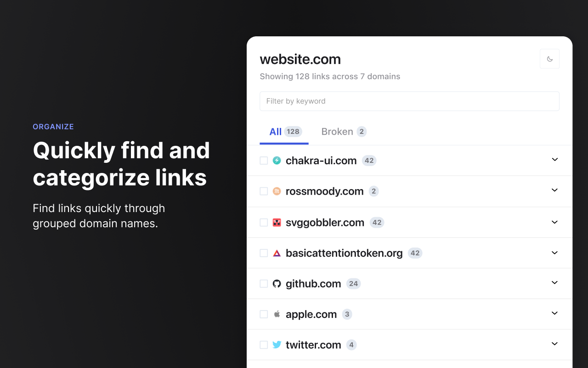

# 👋 Link Roamer


---

> 🚀 Download this extension on the
> [Chrome Web store](https://chrome.google.com/webstore/detail/link-roamer/lgcgflalbmeodapiohjepkjlgipmhofe)
> or the
> [Firefox Addon Marketplace](https://addons.mozilla.org/en-US/firefox/addon/link-roamer/).
> 🚀

---

A browser extension for gathering, organizing, and inspecting all the links on a
web page. It's also pretty good at finding broken links (404). This extension
allows you to:

## Inspect links

- Highlight broken links on a page (i.e. 404)
- Highlight unsecure links on a page (i.e. http)
- Quickly find, view, organize, and navigate links on a page

## Organize links

- Group links by their primary domain name
- Create a tab group from a set of selected links (_\*Chrome only_)
- Save a set of selected links as bookmarks

## Interact with links

- Copy links to clipboard
- Open links in a new window or tab
- Open individual links in a background tab
- Export links as `json`, `text`, or `csv`

---



## Local development

Before making edits you will need to build the extension locally and side load
it as a developer extension to test any changes.

> At the moment, v3 and v2 manifest API conflicts are making things difficult.
> The Rollup config programmatically compiles two different versions depending
> on the manifest. For Chrome, the v3 manifest in the `dist` folder is the one
> to load. For Firefox, you will need to build and load the zipped release
> version with `yarn release`.

### 1. Clone the repo

Clone the repo to your local machine and navigate into the root directory.

```shell
cd link-roamer
```

### 2. Install dependencies

SVG Gobbler uses yarn to build the necessary dependencies.

```shell
yarn
```

### 3. Start and watch a build

For development with automatic reloading:

```bazaar
yarn start
```

This will build to the `dist` folder. To load the extension, open the Extensions
Dashboard, enable "Developer mode", click "Load unpacked", and choose the
`dist/v3-manifest` folder.

When you make changes in src the background script and any content script will
reload automatically.

---

## Open source

This extension is open source and doesn't collect any information from users.
It's free, and made available because I enjoy making useful things for the web.

Please consider contributing with an idea, bug fix, or feature request.

---

## Contribute

Feel free to submit a pull request if you've made an improvement of some kind.
This is an open source project and any help is very appreciated.
